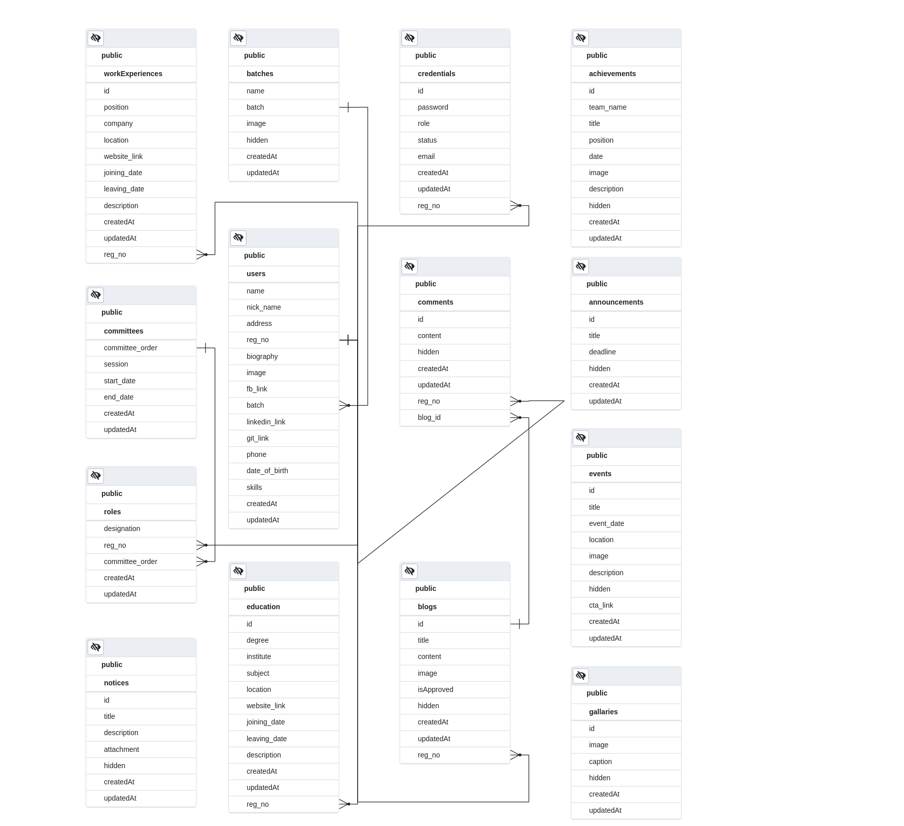

# Backend Api Calls

## User related

### 
- Without any authorization

   * Show All Users : `GET /api/user/`
   * Show Specific User : `GET /api/user/:reg_no/`
   * Show logged In User : `GET /api/user/me/`
   * Login User : `POST /api/user/login/`
        ```json
        Request Body
        {
            "email":"useremail@email.com",
            "password":"xxxxxxxx"
        }
        ```

   * Request Password Reset When Password Is Forgotten ( a token will be sent to user email as a param of reset link ): `POST /api/user/password/forgot/`


        ```json
        Request Body
        {
            "email":"useremail@email.com"
        }
        ```


### 
- Authorized And Performed By User Himself

   * Log Out User : `GET /api/user/logout/`

   * Update User Information : `PATCH /api/user/update/`
        ```json
        Request Body (Can Contain Multiple Or Any Of The Listed Field)
        {
            "fb_link": "https://www.facebook.com/",
            "linkedin_link": "https://www.linkedin.com/",
            "git_link": "https://github.com/mhRumi",
            "phone": "01932981532",
            "date_of_birth": "2000-11-18",
            "biography": "I like to code",
            "skills": ["C++","JAVA","Python","React"],
            "nick_name":"Mobin",
            "address":"New York, USA"
        }
        ```
   * Update User Password : `PATCH /api/user/password/update/`
        ```json
        Request Body
        {
            "oldpassword":"xxxxxxx",
            "newpassword":"yyyyyyy"
        }
        ```
   * Reset User Password  : `PATCH /api/user/password/reset/:token`
        ```json
        Request Body
        {
            "password" : "xxxxxxx"
        }
        ```
   * Request User Email Change ( a token will be sent to new email ): `POST /api/user/email/requestchange/`

        ```json
        Request Body ( with new email )
        {
            "email":"newemail@email.com"
        }
        ```
    * User Email Change : `PATCH /api/user/email/change/`

        ```json
        Request Body
        {
            "password" : "xxxxxxx",
            "token" : "jwttoken"
        }
        ```

    * Add An Educational Info : `POST /api/education/ `

         ```json
        Request Body
        {
            "degree":"msc",
            "institute":"Shahjalal University of Science & Technology",
            "joining_date": "2017-12-30",
            "leaving_date": "2019-12-30",
            "description":"Sust is very popular",
            "subject" : "English",
            "location" : "Dhaka, Bangladesh"
        }
        ```
    * Delete An Educational Info : `DELETE /api/education/:id`
    
    * Update An Educational Info : `PATCH /api/education/:id`
        
        ```json
        Request Body
        {
            "degree":"bsc",
            "institute":"Shahjalal University of Science & Technology",
            "joining_date": "2017-12-30",
            "leaving_date": "2019-12-30",
            "description":"Sust is the best",
            "subject" : "EEE",
            "location" : "Dhaka, Bangladesh"
        }
        ```
    * Get Educational Details of A Specific User : `GET /api/education/:reg_no/`

    * Add A Work Experience  : `POST /api/workexp/ `

         ```json
        Request Body
        {
            "company": "DZIT",
            "position": "Software Engineer",
            "joining_date": "2021-01-08",
            "leaving_date": "2022-01-08",
            "description": "DZIT is very reknown It farm in Bangladesh",
            "location" : "Dhaka, Bangladesh"
        }
        ```
    * Delete A Work Experience : `DELETE /api/workexp/:id`
    
    * Update A Work Experience : `PATCH /api/workexp/:id`
        
        ```json
        Request Body
        {
            "company": "DZIT",
            "position": "Software Engineer",
            "location": "Dhaka, Bangladesh",
            "joining_date": "2021-01-08",
            "leaving_date": "2022-01-08",
            "description": "DZIT is very reknown It farm in Bangladesh"
        }
        ```
    * Get Detailed Work Experiences of A Specific User : `GET /api/workexp/:reg_no/`


### 
- Authorized By Admin / Superadmin

    * Register New Users : `POST /api/user/register/`

        ```json
        Request Body
        [
            {
                "email":"username@email.com",
                "reg_no":"20**831***",
                "name":"certificatename"
            },
            {
                "email":"username@email.com",
                "reg_no":"20**831***",
                "name":"certificatename"
            }
        ]
        ```
    * Delete User : `DELETE /api/user/:reg_no/`

    * Set An User Admin / Superadmin : `PATCH /api/user/setadmin/`

        ```json
        Request Body
        {
            "reg_no": "20178",
            "role":"admin/superadmin"
        }
        ```
    * Set An User Teacher / Alumni : `PATCH /api/user/setstatus/`

        ```json
        Request Body
        {
            "reg_no": "2017831003",
            "status":"teacher/alumni"
        }
        ```
    * Remove An User From Admin / Superadmin : `PATCH /api/user/removeadmin/:reg_no/`

    * Broadcast Email To All Users : `POST /api/user/broadcast/`

      ```json
        Request Body
        {   
            "subject":"Society Fee",
            "message" : "Please pay registration fee within 20 Feb, 2021"
        }
        ```
## Committee related

### 
- With Admin/Superadmin Authorization

   * Add A New Committee : `POST /api/committee/`
        ```json
        Request Body
        {
            "session" : [[2017],[2018]],
            "start_date" : "2021-01-08",
            "end_date" : "2021-02-08"
        }
        ```
    * Update The Current Committee : `PATCH /api/committee/`
        ```json
        Request Body
        {
            "session" : [[2017],[2018]],
            "start_date" : "2021-01-08",
            "end_date" : "2021-02-08"
        }
        ```

    * Add Members To The Current Committee : `POST /api/committee/role`
        ```json
        Request Body
        [
            {
                "designation":"president",
                "reg_no": "2017831034"
            },
            {
                "designation":"vice president",
                "reg_no": "2017831036"
            }
        ]
        ```
    * Update Role Of Members Of The Current Committee : `PATCH /api/committee/role`
        ```json
        Request Body
        [
            {
                "designation":"muchi",
                "reg_no": "2017831034"
            },
            {
                "designation":"darowan",
                "reg_no": "2017831036"
            }
        ]
        ```
    * Remove A Member From The Current Committee : `DELETE /api/committee/role/:reg_no`

- With User Authorization

    * Show All Committees : `GET /api/committee/`
    * Show Current Committee With All Of Its Members  : `GET /api/committee/current`

    * Show A Specific Committee With All Of Its Members  : `GET /api/committee/:committee_order`
    
       ```
## Blog related

### 
- With User Authorization

   * Post A Blog : `POST /api/blogs/`

        ```json
        Request Body
        {
            "title": "How to code c++",
            "content" : "Try hard and practice more",
            "image" : "['cfdcfgh.jpg','abc.jpg']"
        }
        ```
        
   * Update An Existing Blog : `PATCH /api/blogs/:blog_id`
        ```json
        Request Body
        {
            "title": "How to code Java",
            "content" : "Try hard and practice more",
            "image" : "['cfdcfgh.jpg','abc.jpg']"
        }
        ```

   * Show All (Approved) Blogs : `GET /api/blogs/true`
       
   * Show A Single Blog : `GET /api/blogs/:id`

   * Show A Single Not Approved Blog : `GET /api/blogs/false/:id`

   * Show Specific Users Blog : `GET /api/blogs/:reg_no`

   * Delete Own Blog : `Delete /api/blogs/:id`

- With Admin / Superadmin Authorization

   * Approve A Blog : `PATCH /api/blogs/approve/:id`
        
   * Delete (Hide) Any Blog : `Delete /api/blogs/:id`

   * Show All Not Approved Blogs : `GET /api/blogs/false`

## Comment related

### 
- With User Authorization

   * Post A Comment : `POST /api/comments/`
        ```json
        Request Body
        {
            "content": "WOW",
            "blog_id": "4"
        }
        ```
        
   * Update An Existing Comment : `PATCH /api/comments/comment:id`
        ```json
        Request Body
        {
            "content": "WOW"
        }
        ```

   * Show All Comments Of A Blog : `GET /api/comments/:blog_id`

   * Delete Own Comment : `Delete /api/comments/:comment_id`

- With Admin / Superadmin Authorization
        
   * Delete (Hide) Any Comment : `Delete /api/comments/:comment_id`

## Notice related

### 
- Without User Authorization

   * Show All Notices : `GET /api/notice/`
        
- With Admin / Superadmin Authorization
    
   * Post A Notice : `POST /api/notice/`
        ```json
        Request Body
        {
            "title": "society fee",
            "description" : "NULL is allowed",
            "attachment" : ["abc.pdf","xyz.pdf"]
        }
        ```
   * Update Any Notice : `PATCH /api/notice/:notice_id`
        ```json
        Request Body
        {
            "title": "tour fee",
            "description" : "NULL is allowed",
            "attachment" : ["axc.pdf","x2z.pdf"]
        }
        ```
   * Delete (Hide) Any Notice : `DELETE /api/notice/:notice_id`

## Announcement related

### 
- Without User Authorization

   * Show All Announcement : `GET /api/announcement/`
        
- With Admin / Superadmin Authorization
    
   * Post An Announcement : `POST /api/announcement/`
        ```json
        Request Body
        {
            "title": "society fee",
            "deadline" : "2021-02-08T16:45:43.016Z"
        }
        ```
   * Update Any Announcement : `PATCH /api/announcement/:announcement_id`
        ```json
        Request Body
        {
            "title": "tour fee",
            "deadline" : "2021-02-08T16:45:43.016Z"
        }
        ```
   * Delete (Hide) Any Announcement : `DELETE /api/announcement/:announcement_id`

## Achievement related

### 
- Without User Authorization

   * Show All Achievements : `GET /api/achievements/`
        
- With Admin / Superadmin Authorization
    
   * Post An Achievement : `POST /api/achievements/`
        ```json
        Request Body
        {
            "team_name" : "XYZ",
            "title" : "DIU HACKATHON",
            "position":"runner-up",
            "date":"2017-12-30T00:00:00.000Z",
            "image":["aa.jpg","bb.jpg"],
            "description":"it was..."
        }
        ```
   * Update Any Achievement : `PATCH /api/achievements/:achievements_id`
        ```json
        Request Body
        {
            "team_name" : "XYZ",
            "title" : "DIU HACKATHON",
            "position":"runner-up",
            "date":"2017-12-30T00:00:00.000Z",
            "image":["aa.jpg","bb.jpg"],
            "description":"it was..."
        }
        ```
   * Delete (Hide) Any Achievement : `DELETE /api/achievements/:achievement_id`

## Event related

### 
- Without User Authorization

   * Show All Events : `GET /api/event/`
   * Show Specific Event : `GET /api/event/:event_id`
        
- With Admin / Superadmin Authorization
    
   * Post A Event : `POST /api/event/`
        ```json
        Request Body
        {
            "title" : "Badminton Tournament",
            "location": "IICT,SUST",
            "event_date": "2017-12-30T00:00:00.000Z",
            "image": ["aa.jpg","bb.jpg"],
            "description":"it was...",
            "cta_link" : "fb link or something, null is allowed"
        }
        ```
   * Update Any Event : `PATCH /api/event/:event_id`
        ```json
        Request Body
        {
            "title" : "Chess Tournament",
            "location": "IICT,SUST",
            "event_date": "2017-12-30T00:00:00.000Z",
            "image": ["aa.jpg","bb.jpg"],
            "description":"it was...",
            "cta_link" : "fb link or something, null is allowed"
        }
        ```
   * Delete (Hide) Any Event : `DELETE /api/event/:event_id`

## Gallary related

### 
- Without User Authorization

   * Show All Contents : `GET /api/gallary/`
   * Show Specific Content : `GET /api/gallary/:content_id`
        
- With Admin / Superadmin Authorization
    
   * Post A Content : `POST /api/gallary/`
        ```json
        Request Body
        {
            "caption" : "Bijoy Dibosh",
            "image" : "abc.jpg"
        }
        ```
   * Update Any Content : `PATCH /api/gallary/:content_id`
        ```json
        Request Body
        {
            "caption" : "Bijoy Dibosh NA",
            "image" : "abc.jpg"
        }
        ```
   * Delete (Hide) Any Content : `DELETE /api/gallary/:content_id`
   

## Batch related

### 
- Without User Authorization

   * Show All Batches: `GET /api/batch/`
   * Show Specific Batch With Students : `GET /api/batch/:batch_year`
        
- With Admin / Superadmin Authorization
    
   * Create A Batch : `POST /api/batch/`
        ```json
        Request Body
        {
            "name":"Uththan",
            "batch":"2017",
            "image" : "abc.jpg"
        }
        ```
   * Update Any Batch : `PATCH /api/batch/:batch_year`
        ```json
        Request Body
        {
            "name":"Uththan",
            "image" : "xyz.jpg"
        }
        ```
   * Delete (Hide) Any Batch : `DELETE /api/batch/:batch_year`


   
### ER Diagram


